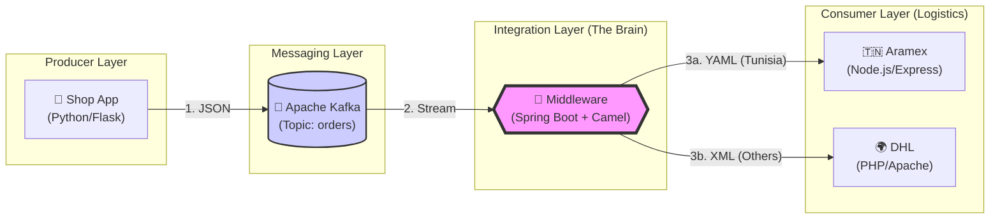

# 📦 Full Integration Project: E-Commerce Logistics 🚚


A complete microservices architecture demonstrating **Enterprise Application Integration (EAI)** using **Kafka**, **Apache Camel (Spring Boot)**, **Python**, **Node.js**, and **PHP**.  
Everything is fully containerized with **Docker** 🐳.


## 📝 Project Description


This project simulates a real-world e-commerce logistics system designed to handle order processing and routing to different shipping partners based on geographical criteria. It showcases a robust, scalable, and extensible architecture built upon microservices communicating asynchronously.


The core components include:


- 🛒 **E-commerce Shop** (Python/Flask): A simple frontend application where users can place orders.
- 📨 **Apache Kafka**: High-throughput message broker ensuring reliable communication and decoupling between services.
- 🧠 **Integration Middleware** (Spring Boot + Apache Camel): The central nervous system that consumes orders, applies routing logic (EIP patterns), and transforms messages (JSON → YAML/XML).
- 🚛 **Logistics Partners**:
  - 🇹🇳 **Aramex** (Node.js/Express): Handles domestic deliveries (Tunisia).
  - 🌍 **DHL** (PHP/Apache): Handles international deliveries.


## 🛠️ Technologies Used


| Category           | Technology                                   |
|--------------------|----------------------------------------------|
| Orchestration      | Docker, Docker Compose                       |
| Message Broker     | Apache Kafka, Zookeeper                      |
| Integration        | Apache Camel (EIP patterns)                  |
| Backend Frameworks | Spring Boot (Java), Flask (Python), Express.js (Node.js) |
| Web Server         | Apache HTTP Server (for PHP)                 |
| Data Formats       | JSON, YAML, XML                              |
| Monitoring         | Hawtio, Kafka UI                             |


## 📋 Prerequisites


- ✅ Docker Desktop installed and running


**Note:** You do **NOT** need to install Java, Maven, Python, Node.js, or PHP locally. Docker handles the entire environment!


## 🚀 How to Run


1. Clone the repository and open a terminal in the project root folder.
2. Start the entire system:
   ```bash
   docker-compose up -d --build
   ```
   This builds the Shop, Middleware, Aramex, and DHL services and starts Kafka/Zookeeper.
3. Verify everything is running:
   ```bash
   docker-compose ps
   ```


## 🖥️ How to Use


### 1. 🛒 Place an Order (The Shop)
Open your browser:  
👉 http://localhost:5000


- Enter **Item**, **Price**, and select a **Country**  
- Click **Send Order**


### 2. 📊 Visualize the Flow (Middleware Dashboard)
See real-time routing, diagrams, and counters:  
👉 http://localhost:8080/actuator/hawtio


Navigate to: **Camel** (left sidebar) → **Routes** → **route1** → **Route Diagram**


### 3. 📈 Monitor Kafka Topics (Kafka UI)
Inspect messages directly in the Kafka broker:  
👉 http://localhost:8090


- Go to **Topics** → **orders** to see raw JSON messages arriving from the Shop.


### 4. 🔍 Check the Logs (Debugging)


- **Middleware** (routing logic):
  ```bash
  docker-compose logs -f middleware
  ```


- **Aramex** (Tunisia orders):
  ```bash
  docker-compose logs -f aramex
  ```


- **DHL** (international orders):
  ```bash
  docker-compose logs -f dhl
  ```


## ⚙️ Architecture & Logic


1. **Producer**: The Shop App (Python/Flask) sends the order as JSON to the Kafka topic `orders`.
2. **Consumer**: The Middleware (Spring Boot + Camel) listens to the topic.
3. **Routing (Content-Based Router)**:
   - 🇹🇳 If **Country = Tunisia** → Convert to **YAML** → Send to **Aramex** (Node.js)
   - 🌍 For **any other country** (e.g., France, Germany) → Convert to **XML** → Send to **DHL** (PHP)





## 📁 Project Structure


```
full-project/
├── docker-compose.yml          # Orchestrates all services
├── shop/                       # Python Flask App (Producer)
│   ├── app.py
│   ├── templates/
│   └── Dockerfile
├── middleware/                 # Spring Boot + Camel App (Integration)
│   ├── src/main/java/...
│   ├── pom.xml
│   └── Dockerfile
├── aramex/                     # Node.js App (Aramex endpoint)
│   ├── server.js
│   └── Dockerfile
└── dhl/                        # PHP App (DHL endpoint)
    ├── dhl.php
    ├── dhl.log
    └── Dockerfile
```


## 🛑 How to Stop


Stop all containers and clean up the network:
```bash
docker-compose down
```


Enjoy exploring this full EAI integration scenario! 🎉
