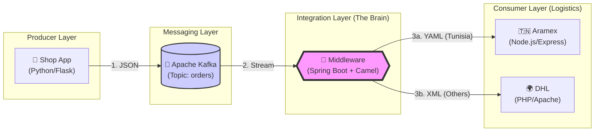

# 📦 Full Integration Project: E-Commerce Logistics 🚚

[](https://github.com/oussemabouchoucha/Kafka-Camel-Integration-Demo)
[](https://www.docker.com/)
[](LICENSE)

A complete microservices architecture demonstrating **Enterprise Application Integration (EAI)** using **Kafka**, **Apache Camel (Spring Boot)**, **Python**, **Node.js**, and **PHP**.  
Everything is fully containerized with **Docker** 🐳.


## 📝 Project Description


This project simulates a real-world e-commerce logistics system designed to handle order processing and routing to different shipping partners based on geographical criteria. It showcases a robust, scalable, and extensible architecture built upon microservices communicating asynchronously.


The core components include:


- 🛒 **E-commerce Shop** (Python/Flask): A simple frontend application where users can place orders.
- 📨 **Apache Kafka**: High-throughput message broker ensuring reliable communication and decoupling between services.
- 🧠 **Integration Middleware** (Spring Boot + Apache Camel): The central nervous system that consumes orders, applies routing logic (EIP patterns), and transforms messages (JSON → YAML/XML).
- 🚛 **Logistics Partners**:
  - 🇹🇳 **Aramex** (Node.js/Express): Handles domestic deliveries (Tunisia).
  - 🌍 **DHL** (PHP/Apache): Handles international deliveries.


## 🛠️ Technologies Used


| Category           | Technology                                   |
|--------------------|----------------------------------------------|
| Orchestration      | Docker, Docker Compose                       |
| Message Broker     | Apache Kafka, Zookeeper                      |
| Integration        | Apache Camel (EIP patterns)                  |
| Backend Frameworks | Spring Boot (Java), Flask (Python), Express.js (Node.js) |
| Web Server         | Apache HTTP Server (for PHP)                 |
| Data Formats       | JSON, YAML, XML                              |
| Monitoring         | Hawtio, Kafka UI                             |


## 📋 Prerequisites

- ✅ Docker Desktop installed and running
- ✅ Git (for cloning the repository)
- ✅ At least 8GB RAM available for Docker
- ✅ Ports available: 5000, 3000, 8080, 8081, 8090, 9092

**Note:** You do **NOT** need to install Java, Maven, Python, Node.js, or PHP locally. Docker handles the entire environment!


## 🚀 How to Run

### Quick Start

1. **Clone the repository:**
   ```bash
   git clone https://github.com/oussemabouchoucha/Kafka-Camel-Integration-Demo.git
   cd Kafka-Camel-Integration-Demo
   ```

2. **Start the entire system:**
   ```bash
   docker-compose up -d --build
   ```
   This builds the Shop, Middleware, Aramex, and DHL services and starts Kafka/Zookeeper.

3. **Verify everything is running:**
   ```bash
   docker-compose ps
   ```
   All services should show as "Up".

4. **Wait for services to be ready** (approximately 30-60 seconds for Kafka initialization)


## 🖥️ How to Use


### 1. 🛒 Place an Order (The Shop)
Open your browser:  
👉 http://localhost:5000


- Enter **Item**, **Price**, and select a **Country**  
- Click **Send Order**


### 2. 📊 Visualize the Flow (Middleware Dashboard)
See real-time routing, diagrams, and counters:  
👉 http://localhost:8080/actuator/hawtio


Navigate to: **Camel** (left sidebar) → **Routes** → **route1** → **Route Diagram**


### 3. 📈 Monitor Kafka Topics (Kafka UI)
Inspect messages directly in the Kafka broker:  
👉 http://localhost:8090


- Go to **Topics** → **orders** to see raw JSON messages arriving from the Shop.


### 4. 🔍 Check the Logs (Debugging)


- **Middleware** (routing logic):
  ```bash
  docker-compose logs -f middleware
  ```


- **Aramex** (Tunisia orders):
  ```bash
  docker-compose logs -f aramex
  ```


- **DHL** (international orders):
  ```bash
  docker-compose logs -f dhl
  ```


## ⚙️ Architecture & Logic


1. **Producer**: The Shop App (Python/Flask) sends the order as JSON to the Kafka topic `orders`.
2. **Consumer**: The Middleware (Spring Boot + Camel) listens to the topic.
3. **Routing (Content-Based Router)**:
   - 🇹🇳 If **Country = Tunisia** → Convert to **YAML** → Send to **Aramex** (Node.js)
   - 🌍 For **any other country** (e.g., France, Germany) → Convert to **XML** → Send to **DHL** (PHP)





## 📁 Project Structure

```
Kafka-Camel-Integration-Demo/
├── docker-compose.yml          # Orchestrates all services
├── README.md                   # Project documentation (you are here)
├── RapportTechnique.md        # Technical report (French)
├── shop/                       # Python Flask App (Producer)
│   ├── app.py                 # Main application
│   ├── producer.py            # Kafka producer logic
│   ├── templates/             # HTML templates
│   ├── requirements.txt       # Python dependencies
│   └── Dockerfile
├── middleware/                 # Spring Boot + Camel App (Integration)
│   ├── src/main/java/com/example/middleware/
│   │   ├── MiddlewareApplication.java  # Main Spring Boot app
│   │   └── IntegrationRoute.java       # Apache Camel routing logic
│   ├── src/main/resources/
│   │   └── application.properties      # Configuration
│   ├── pom.xml                # Maven dependencies
│   └── Dockerfile
├── aramex/                     # Node.js App (Aramex endpoint)
│   ├── server.js              # Express.js server
│   ├── public/                # Static files
│   ├── package.json           # Node dependencies
│   └── Dockerfile
└── dhl/                        # PHP App (DHL endpoint)
    ├── dhl.php                # REST endpoint handler
    ├── dhl.log                # Delivery logs
    └── (uses php:apache image)
```


## 🛑 How to Stop

Stop all containers and clean up the network:
```bash
docker-compose down
```

To remove volumes (reset Kafka data):
```bash
docker-compose down -v
```

## 🤝 Contributing

Contributions are welcome! Feel free to:
- 🐛 Report bugs
- 💡 Suggest new features
- 🔧 Submit pull requests

### How to Contribute

1. Fork the repository
2. Create your feature branch: `git checkout -b feature/AmazingFeature`
3. Commit your changes: `git commit -m 'Add some AmazingFeature'`
4. Push to the branch: `git push origin feature/AmazingFeature`
5. Open a Pull Request

## 📝 Additional Documentation

- **Technical Report (French):** See [RapportTechnique.md](RapportTechnique.md) for detailed technical documentation
- **Repository:** [GitHub - Kafka-Camel-Integration-Demo](https://github.com/oussemabouchoucha/Kafka-Camel-Integration-Demo)

## 📊 Service Ports Reference

| Service      | Port  | URL                              | Description                    |
|--------------|-------|----------------------------------|--------------------------------|
| Shop         | 5000  | http://localhost:5000            | Order placement interface      |
| Middleware   | 8080  | http://localhost:8080/actuator/hawtio | Camel routes dashboard |
| Aramex       | 3000  | http://localhost:3000            | Tunisia deliveries endpoint    |
| DHL          | 8081  | http://localhost:8081            | International deliveries       |
| Kafka UI     | 8090  | http://localhost:8090            | Kafka topic monitoring         |
| Kafka Broker | 9092  | localhost:9092                   | Kafka connection (internal)    |

## 🔧 Troubleshooting

### Common Issues:

**Port already in use:**
```bash
# Check which services are using the ports
docker-compose down
# Check if any containers are still running
docker ps -a
```

**Kafka connection issues:**
- Wait 30-60 seconds after `docker-compose up` for Kafka to fully initialize
- Check logs: `docker-compose logs kafka`

**Middleware not starting:**
```bash
docker-compose logs middleware
# Often related to Kafka not being ready yet
```

**Orders not appearing:**
- Verify Kafka is running: `docker-compose logs kafka`
- Check middleware logs: `docker-compose logs -f middleware`
- Access Kafka UI at http://localhost:8090 to inspect topics

## 📜 License

This project is created for educational purposes demonstrating Enterprise Integration Patterns.

## 👨‍💻 Authors

- **Oussema Bouchoucha** - [GitHub](https://github.com/oussemabouchoucha)

---

Enjoy exploring this full EAI integration scenario! 🎉
