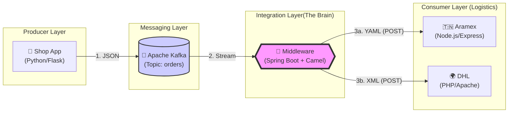
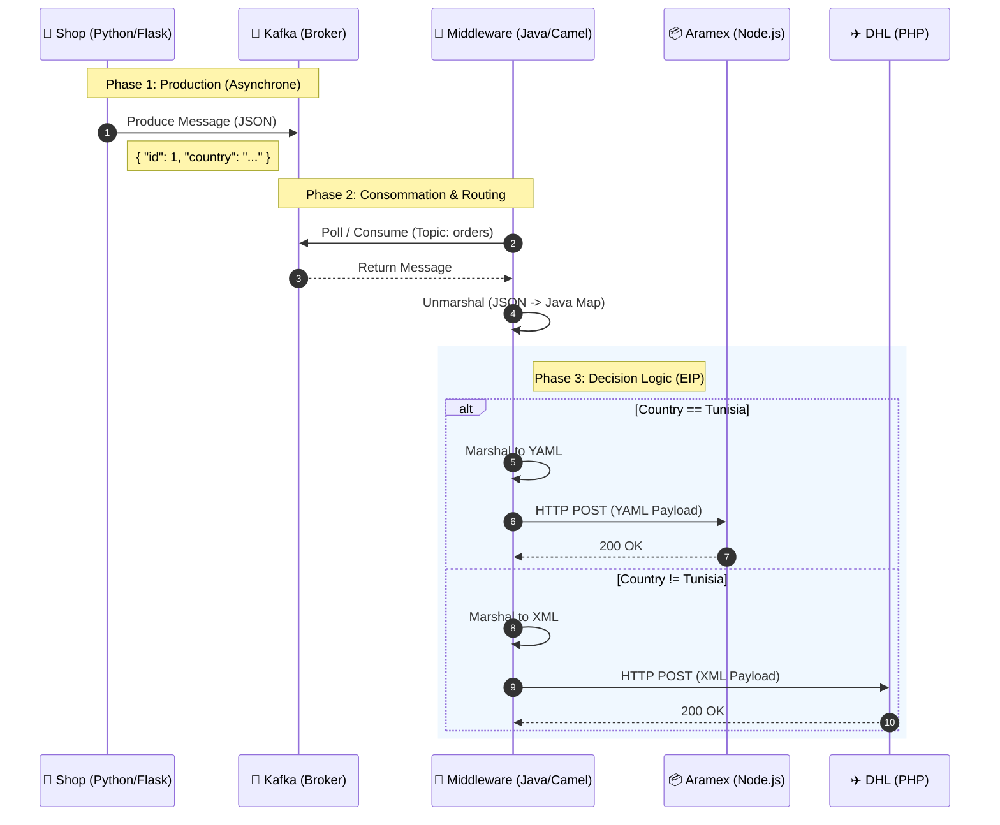

# 📘 Rapport Technique Détaillé : Système d'Intégration Logistique (EAI)

## 1. Vue D'ensemble (Architecture Overview)

Ce projet met en œuvre une architecture **Event-Driven** (orientée événements) découplée, utilisant **Apache Kafka** comme bus de messages et **Apache Camel** comme moteur d'orchestration et d'intégration (Middleware).  
L'objectif est d'assurer une communication fluide, résiliente et scalable entre une plateforme de vente et différents prestataires logistiques hétérogènes.

### 🏗️ Schéma d'Architecture (Flux Global)



## 2. Diagramme de Séquence (Orchestration Temporelle)

Ce diagramme illustre le cycle de vie exact d'une commande et l'ordre chronologique des échanges entre les microservices.



## 3. Flux de Transformation des Données (Data Transformation Flow)

L’un des objectifs principaux de ce projet est l’**interopérabilité** entre systèmes hétérogènes. Voici comment la donnée évolue à chaque étape grâce aux capacités de **Marshalling / Unmarshalling** de Camel.

### 🔹 Étape 1 : Entrée (Shop → Kafka)
Le Producer (Python/Flask) envoie un format standard **JSON**.

```json
{
  "id": 101,
  "item": "Laptop",
  "country": "Tunisia",
  "price": 2500
}
```

### 🔹 Étape 2 : Traitement Interne (Camel)
Camel désérialise le JSON en un objet Java (`java.util.Map`) pour lire le champ `country` et appliquer une logique de routage dynamique (**Content-Based Router**).

### 🔹 Étape 3 : Sortie (Camel → Partenaires)

- **Cas A : Aramex (Node.js)** – Format **YAML**

```yaml
id: 101
item: Laptop
country: Tunisia
price: 2500
```

- **Cas B : DHL (PHP)** – Format **XML**

```xml
<LinkedHashMap>
    <id>101</id>
    <item>Laptop</item>
    <country>France</country>
    <price>2500</price>
</LinkedHashMap>
```

## 4. Stack Technologique & Justification

| Composant              | Technologie                          | Rôle & Justification |
|------------------------|--------------------------------------|----------------------|
| Broker de Messages     | Apache Kafka + Zookeeper             | Garantit la persistance, la résilience et le découplage total. Le Shop peut continuer à fonctionner même en cas de panne des partenaires logistiques. |
| Orchestrateur          | Apache Camel                         | Implémente facilement les **Enterprise Integration Patterns (EIP)** : routage conditionnel, transformation de formats, gestion d’erreurs. |
| Application Middleware | Spring Boot 3                        | Conteneur robuste avec configuration externe, monitoring intégré et injection de dépendances. |
| Conteneurisation       | Docker & Docker Compose              | Simule un environnement entreprise complet sur une seule machine, assure portabilité et reproductibilité. |

## 5. Observabilité & Monitoring

Deux outils de monitoring sont intégrés à l’infrastructure Docker :

- **Kafka UI** (`http://localhost:8090`)  
  Visualisation du cluster Kafka, des topics (`orders`), et inspection en temps réel des messages JSON bruts. Idéal pour déboguer la couche transport.

- **Hawtio** (`http://localhost:8080/actuator/hawtio`)  
  Tableau de bord dédié à Apache Camel : visualisation graphique des routes EIP, comptage des messages traités par branche (Aramex vs DHL), détection des goulots d’étranglement.

## 6. Perspectives d'Amélioration

Ce projet constitue un socle solide qui pourrait être étendu par :

- **Sécurité** : SSL/TLS pour Kafka, OAuth2/JWT pour les APIs REST.
- **Gestion d’erreurs avancée** : Dead Letter Queue (DLQ), retry policies, circuit breaker.
- **Scalabilité** : Migration vers Kubernetes pour orchestration et auto-scaling des services.
- **Enrichissement fonctionnel** : Ajout de nouveaux partenaires logistiques (ex. FedEx, UPS) via de nouvelles routes Camel.

## 7. Conclusion Technique

Ce projet démontre une architecture **résiliente, évolutive et maintenable** :

- **Scalabilité** : Kafka absorbe les pics de charge sans perte de messages.
- **Flexibilité** : L’ajout d’un nouveau partenaire logistique ne nécessite aucune modification du Shop – uniquement une nouvelle route dans le Middleware.
- **Standardisation** : Utilisation de Docker et de protocoles standards (HTTP, JSON, YAML, XML) garantit la pérennité de la solution.

> « La théorie, c'est quand on sait tout et que rien ne fonctionne. La pratique, c'est quand tout fonctionne et que personne ne sait pourquoi. Ici, nous avons réuni la théorie et la pratique : tout fonctionne et nous savons exactement pourquoi. »  
> — Albert Einstein (adapté) 😉

---
*Projet réalisé dans un objectif pédagogique et démonstratif d’intégration d’entreprise (EAI).*
