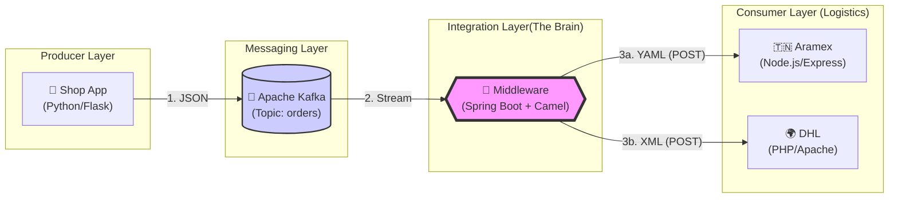
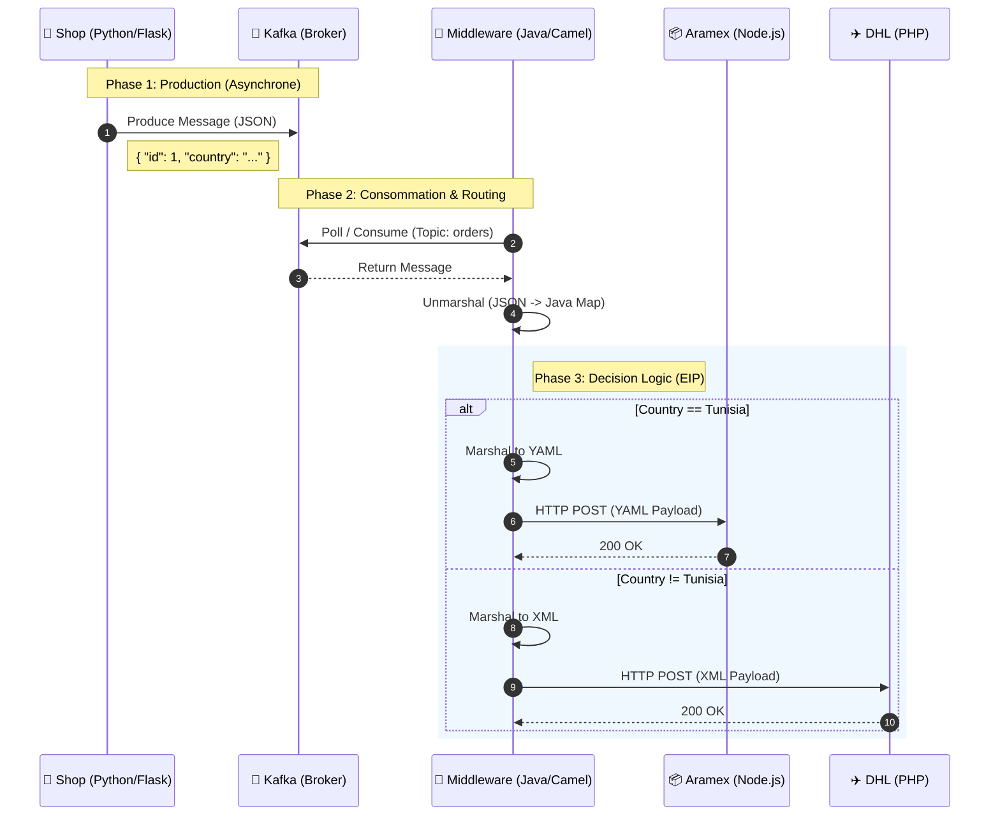

# 📘 Rapport Technique Détaillé : Système d'Intégration Logistique (EAI)

## 1. Vue D'ensemble (Architecture Overview)

Ce projet met en œuvre une architecture **Event-Driven** (orientée événements) découplée, utilisant **Apache Kafka** comme bus de messages et **Apache Camel** comme moteur d'orchestration et d'intégration (Middleware).  
L'objectif est d'assurer une communication fluide, résiliente et scalable entre une plateforme de vente et différents prestataires logistiques hétérogènes.

### 🏗️ Schéma d'Architecture (Flux Global)


```mermaid
graph LR
    subgraph "Producer Layer"
        P["🛒 Shop App<br/>(Python/Flask)"]
    end

    subgraph "Messaging Layer"
        K[("📨 Apache Kafka<br/>(Topic: orders)")]
    end

    subgraph "Integration Layer(The Brain)"
        C{{"🐫 Middleware<br/>(Spring Boot + Camel)"}}
    end

    subgraph "Consumer Layer (Logistics)"
        A["🇹🇳 Aramex<br/>(Node.js/Express)"]
        D["🌍 DHL<br/>(PHP/Apache)"]
    end

    P -- "1. JSON" --> K
    K -- "2. Stream" --> C
    C -- "3a. YAML (POST)" --> A
    C -- "3b. XML (POST)" --> D

    style C fill:#f9f,stroke:#333,stroke-width:4px
    style K fill:#ccf,stroke:#333,stroke-width:2px
```

## 2. Diagramme de Séquence (Orchestration Temporelle)

Ce diagramme illustre le cycle de vie exact d'une commande et l'ordre chronologique des échanges entre les microservices.


```mermaid
sequenceDiagram
    autonumber
    participant Shop as 🐍 Shop (Python/Flask)
    participant Kafka as 📨 Kafka (Broker)
    participant Camel as 🐫 Middleware (Java/Camel)
    participant Aramex as 📦 Aramex (Node.js)
    participant DHL as ✈️ DHL (PHP)

    Note over Shop, Kafka: Phase 1: Production (Asynchrone)
    Shop->>Kafka: Produce Message (JSON)
    Note right of Shop: { "id": 1, "country": "..." }

    Note over Kafka, Camel: Phase 2: Consommation & Routing
    Camel->>Kafka: Poll / Consume (Topic: orders)
    Kafka-->>Camel: Return Message
    Camel->>Camel: Unmarshal (JSON -> Java Map)
    
    rect rgb(240, 248, 255)
        Note right of Camel: Phase 3: Decision Logic (EIP)
        alt Country == Tunisia
            Camel->>Camel: Marshal to YAML
            Camel->>Aramex: HTTP POST (YAML Payload)
            Aramex-->>Camel: 200 OK
        else Country != Tunisia
            Camel->>Camel: Marshal to XML
            Camel->>DHL: HTTP POST (XML Payload)
            DHL-->>Camel: 200 OK
        end
    end
```

## 3. Flux de Transformation des Données (Data Transformation Flow)

L’un des objectifs principaux de ce projet est l’**interopérabilité** entre systèmes hétérogènes. Voici comment la donnée évolue à chaque étape grâce aux capacités de **Marshalling / Unmarshalling** de Camel.

### 🔹 Étape 1 : Entrée (Shop → Kafka)
Le Producer (Python/Flask) envoie un format standard **JSON**.

```json
{
  "id": 101,
  "item": "Laptop",
  "country": "Tunisia",
  "price": 2500
}
```

### 🔹 Étape 2 : Traitement Interne (Camel)
Camel désérialise le JSON en un objet Java (`java.util.Map`) pour lire le champ `country` et appliquer une logique de routage dynamique (**Content-Based Router**).

### 🔹 Étape 3 : Sortie (Camel → Partenaires)

- **Cas A : Aramex (Node.js)** – Format **YAML**

```yaml
id: 101
item: Laptop
country: Tunisia
price: 2500
```

- **Cas B : DHL (PHP)** – Format **XML**

```xml
<LinkedHashMap>
    <id>101</id>
    <item>Laptop</item>
    <country>France</country>
    <price>2500</price>
</LinkedHashMap>
```

## 4. Stack Technologique & Justification

| Composant              | Technologie                          | Rôle & Justification |
|------------------------|--------------------------------------|----------------------|
| Broker de Messages     | Apache Kafka + Zookeeper             | Garantit la persistance, la résilience et le découplage total. Le Shop peut continuer à fonctionner même en cas de panne des partenaires logistiques. |
| Orchestrateur          | Apache Camel                         | Implémente facilement les **Enterprise Integration Patterns (EIP)** : routage conditionnel, transformation de formats, gestion d’erreurs. |
| Application Middleware | Spring Boot 3                        | Conteneur robuste avec configuration externe, monitoring intégré et injection de dépendances. || Base de Données        | PostgreSQL 15                        | Stockage persistant et partagé pour tous les services. Remplace le stockage fichier par une base relationnelle offrant transactions ACID, requêtes SQL avancées et intégrité des données. |
| Gestion de BDD         | pgAdmin 4                            | Interface web pour l'administration, la visualisation et l'inspection des données PostgreSQL. Permet de valider les insertions, exécuter des requêtes SQL et surveiller les tables. || Conteneurisation       | Docker & Docker Compose              | Simule un environnement entreprise complet sur une seule machine, assure portabilité et reproductibilité. |

## 5. Observabilité & Monitoring

Plusieurs outils de monitoring et d'administration sont intégrés à l'infrastructure Docker :

- **Kafka UI** (`http://localhost:8090`)  
  Visualisation du cluster Kafka, des topics (`orders`, `order-status-updates`), et inspection en temps réel des messages JSON bruts. Idéal pour déboguer la couche transport.

- **Hawtio** (`http://localhost:8080/actuator/hawtio`)  
  Tableau de bord dédié à Apache Camel : visualisation graphique des routes EIP, comptage des messages traités par branche (Aramex vs DHL), détection des goulots d'étranglement.

- **pgAdmin** (`http://localhost:5050`)  
  Interface web pour la gestion complète de PostgreSQL. Permet d'inspecter les trois tables (`shop_orders`, `aramex_orders`, `dhl_orders`), d'exécuter des requêtes SQL personnalisées et de valider la persistance des données. Login : `admin@admin.com` / `admin`.

## 6. Gestion de la Persistance des Données

### Architecture de Stockage

Le projet utilise **PostgreSQL 15** comme base de données unique et partagée (`logistics_db`) pour tous les microservices. Cette approche offre plusieurs avantages par rapport au stockage fichier initial :

#### Tables et Schéma

- **shop_orders** : Toutes les commandes créées depuis l'interface Shop
- **aramex_orders** : Commandes nationales (Tunisie) gérées par Aramex
- **dhl_orders** : Commandes internationales gérées par DHL

Chaque table contient : `id`, `first_name`, `last_name`, `phone`, `item`, `price`, `country`, `status`, `created_at`.

#### Intégration par Service

- **Shop (Python/Flask)** : Utilise **Flask-SQLAlchemy** avec ORM et modèle `ShopOrder`
- **Aramex (Node.js)** : Bibliothèque **pg** avec connection pooling et requêtes paramétrées
- **DHL (PHP)** : **PDO** avec extension `pdo_pgsql` installée via Dockerfile personnalisé

#### Avantages Techniques

✅ **Transactions ACID** : Garantie de cohérence des données  
✅ **Accès concurrent sécurisé** : Plus de problèmes de verrouillage de fichiers  
✅ **Requêtes SQL avancées** : Agrégations, jointures, filtres complexes  
✅ **Persistance fiable** : Les données survivent aux redémarrages de conteneurs  
✅ **Volume Docker** : `postgres_data` assure la durabilité des données  

## 7. Perspectives d'Amélioration

Ce projet constitue un socle solide qui pourrait être étendu par :

- **Sécurité** : SSL/TLS pour Kafka, OAuth2/JWT pour les APIs REST, chiffrement des données sensibles en base.
- **Gestion d'erreurs avancée** : Dead Letter Queue (DLQ), retry policies, circuit breaker.
- **Scalabilité** : Migration vers Kubernetes pour orchestration et auto-scaling des services, réplication PostgreSQL.
- **Enrichissement fonctionnel** : Ajout de nouveaux partenaires logistiques (ex. FedEx, UPS) via de nouvelles routes Camel.
- **Optimisation base de données** : Index sur les colonnes fréquemment requêtées, partitionnement des tables volumineuses.

## 8. Conclusion Technique

Ce projet démontre une architecture **résiliente, évolutive et maintenable** :

- **Scalabilité** : Kafka absorbe les pics de charge sans perte de messages.
- **Flexibilité** : L’ajout d’un nouveau partenaire logistique ne nécessite aucune modification du Shop – uniquement une nouvelle route dans le Middleware.
- **Standardisation** : Utilisation de Docker et de protocoles standards (HTTP, JSON, YAML, XML) garantit la pérennité de la solution.

> « La théorie, c'est quand on sait tout et que rien ne fonctionne. La pratique, c'est quand tout fonctionne et que personne ne sait pourquoi. Ici, nous avons réuni la théorie et la pratique : tout fonctionne et nous savons exactement pourquoi. »  
> — Albert Einstein (adapté) 😉

---
*Projet réalisé dans un objectif pédagogique et démonstratif d’intégration d’entreprise (EAI).*
